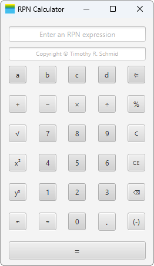

# RPN Calculator

[](https://github.com/Sigrist-und-Partner-AG/rpn-calc/actions/workflows/ci.yml)
[](https://github.com/Sigrist-und-Partner-AG/rpn-calc/releases/latest)
[](LICENSE)



A JavaFX calculator for evaluating expressions in Reverse Polish Notation.

## Quickstart

With JDK 11 and Maven installed:

```shell
mvn javafx:run
```

If you are using Nix, you can run the application directly:

```shell
nix run
```

## Usage

Enter an RPN expression and press the enter key or `=` button.
For example:

```text
2 3 + ⏎
5 2 * neg ⏎
9 sqrt ⏎
```

RPN evaluates expressions from left to right using a stack, eliminating the need for operator precedence and parentheses.

Calculations can be performed incrementally...

```text
1 ⏎ 2 ⏎ 3 ⏎ + ⏎ + ⏎
```

...or as a single expression:

```text
1 2 3 + + ⏎
```

Entering the full expression at once avoids intermediate rounding.

## Details

This project implements a GUI-based RPN calculator operating on 64-bit IEEE-754 floating point numbers.
**RPN** is short for **Reverse Polish Notation**, which is also commonly known as **Postfix Notation**.
See the [Wikipedia entry](https://en.wikipedia.org/wiki/Reverse_Polish_notation)
for details.

### Intuition

Infix expressions can be rewritten to postfix form without changing their meaning:

| Infix           | Postfix         |
|:----------------|:----------------|
| `2 + 3`         | `2 3 +`         |
| `7 - 9`         | `7 9 -`         |
| `4 - 6 * 2`     | `4 6 2 * -`     |
| `8 / 2 + 9 * 9` | `8 2 / 9 9 * +` |
| `3 * (9 - 4)`   | `3 9 4 - *`     |

### Precision

All calculations use 64-bit floating point precision.

The displayed output precision can be adjusted via the `↤` and `↦` buttons.
Results are rounded to the selected number of digits. If multiple values remain
on the stack, the same rounding is applied to each of them.

### Operators

The calculator supports unary, binary, and n-ary operators.
N-ary operators consume all values on the stack.

#### Unary Operators

| Operator | Example   | Result | Description    |
|:--------:|:----------|-------:|:---------------|
| `neg`    | `94 neg`  |  `-94` | Negation       |
| `abs`    | `-7 abs`  |    `7` | Absolute value |
| `pow2`   | `8 pow2`  |   `64` | Square         |
| `sqrt`   | `16 sqrt` |    `4` | Square root    |

#### Binary Operators

| Operator | Example   | Result | Description         |
|:--------:|:----------|-------:|:--------------------|
| `+`      | `2 3 +`   |    `5` | Addition            |
| `-`      | `1 4 -`   |   `-3` | Subtraction         |
| `*`      | `2 5 *`   |   `10` | Multiplication      |
| `/`      | `3 2 /`   |  `1.5` | Division            |
| `%`      | `-21 4 %` |   `-1` | Remainder           |
| `pow`    | `2 3 pow` |    `8` | Exponentiation      |
| `<=`     | `17 a <=` |   `17` | Store in register\* |

#### N-ary Operators

| Operator | Example       | Result | Description |
|:--------:|:--------------|-------:|:------------|
| `sum`    | `1 2 3 sum`   |    `6` | Summation   |
| `avg`    | `4 5 avg`     |  `4.5` | Average     |
| `min`    | `9 -3 4 min`  |   `-3` | Minimum     |
| `max`    | `5 10 2 max`  |   `10` | Maximum     |
| `cnt`    | `1 3 5 7 cnt` |    `4` | Count       |

_\*The operand immediately preceding `<=` must be a register (i.e. an assignable location)._

### Registers

Registers allow values to be stored and reused across calculations.

General-purpose registers range from lowercase `a` to `z`, each initialized to `0.0`.

Additionally, certain uppercase registers are predefined:

| Register | Value                      |
|:--------:|:---------------------------|
| `PI`     | `Math.PI`                  |
| `E`      | `Math.E`                   |
| `MIN`    | `Double.MIN_VALUE`         |
| `MAX`    | `Double.MAX_VALUE`         |
| `INF`    | `Double.POSITIVE_INFINITY` |
| `NAN`    | `Double.NaN`               |

Registers behave like values unless followed by `<=`, which assigns to them:

| Input        |  Output |
|:-------------|--------:|
| `1 a <=`     |     `1` |
| `3 3 * b <=` |     `9` |
| `a b + c <=` |    `10` |

Chained assignments are well-defined:

| Input               |   Output |
|:--------------------|---------:|
| `1 a <= b <= c <=`  |      `1` |
| `20 x <= 40 y <= +` |     `60` |
| `PI z <= sqrt`      | `1.772…` |
| `5 f <= f *`        |     `25` |

### Pitfalls

IEEE-754 defines special values that may arise during computation:

| Value       | Example  | Description         |
|:-----------:|:---------|:--------------------|
| `NaN`       | `0 0 /`  | Not a number        |
| `Infinity`  | `1 0 /`  | Same as `+Infinity` |
| `+Infinity` | `1 0 /`  | Positive infinity   |
| `-Infinity` | `-1 0 /` | Negative infinity   |

Once created, these values propagate through expressions, poisoning subsequent results:

| Input                 |      Output |
|:----------------------|------------:|
| `NaN 1 +`             |       `NaN` |
| `NaN Infinity *`      |       `NaN` |
| `Infinity Infinity /` |       `NaN` |
| `Infinity neg`        | `-Infinity` |
| `-Infinity neg`       | `Infinity`  |

## Development

Run all tests:

```shell
mvn test
```

Generate the documentation:

```shell
# Index page at 'target/reports/apidocs/index.html'
mvn javadoc:javadoc
```

Build the runtime image:

```shell
# Launcher at 'target/jlink-image/bin/rpn-calc'
mvn javafx:jlink
```

Alternatively, build a shaded JAR:

```shell
# Generates 'target/rpn-calc-1.0-SNAPSHOT.jar'
mvn package
```

Run the shaded JAR:

```shell
# On the same platform
java -jar target/rpn-calc-1.0-SNAPSHOT.jar

# With an explicit JavaFX SDK (for example, on a different platform)
java -p "$JAVAFX_PATH" --add-modules javafx.controls,javafx.fxml -jar target/rpn-calc-1.0-SNAPSHOT.jar
```

### Nix Workflow

Run all tests and verify documentation generation:

```shell
nix flake check
```

Generate the documentation:

```shell
# Index page at 'result/index.html'
nix build .#javadocs
```

Build the runtime image:

```shell
# Launcher at 'result/bin/rpn-calc'
nix build
```

Enter the development shell:

```shell
nix develop
```

> [!TIP]
> All documented `mvn` commands work inside the development shell.
